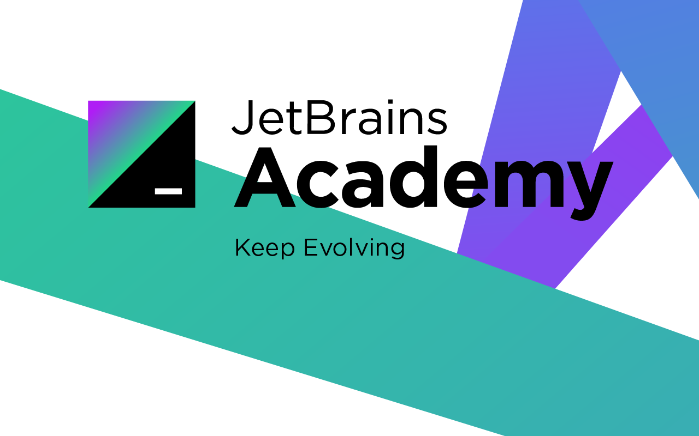

## account-service

Companies send out payrolls to employees using corporate mail.  
This solution has certain disadvantages related to security and usability.   
In this project, put on a robe of such an employee. As you're familiar with Java and Spring Framework, 
you've suggested an idea of sending payrolls to the employee's account on the corporate website.   
The management has approved your idea, but it will be you who will implement this project. 
You've decided to start by developing the API structure, then define the role model, implement the business logic, 
and, of course, ensure the security of the service.

### Overview

This was a project I studied and worked on via this awesome educational platform 
called [JetBrains Academy](https://hyperskill.org/).  
What's more interesting is that you can access it locally via IntelliJ's 
[EduTools plugin](https://plugins.jetbrains.com/plugin/10081-edutools).   

### Technologies
- Java 11
- gradle
- Spring data JPA
- Spring Security
- H2 Database

### Notes
- This project uses an "H2 Database" that should be added as [service_db.h2.db] on project directory.
- Provided with a [postman.collection](account-service.postman_collection.json) file.

## Authors

